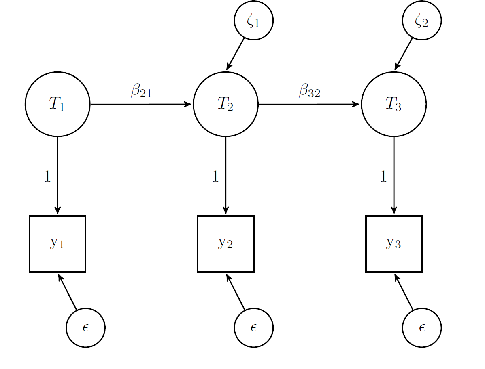

```{r setup, include=FALSE}

knitr::opts_chunk$set(echo = F, warning = F, message = F, error = F)


# install packages
pkg <- c("knitr", "tidyverse", "lavaan", "corrplot", "blavaan")

# sapply(pkg, install.packages)
sapply(pkg, library, character.only = T)


# load data ---------------------------------------------------------------

barca_raw <- read_csv("./data/raw/neighbourhoods.csv")
barca_2y <- read_csv("./data/clean/neighbourhoods_2years.csv")


# data cleaning -----------------------------------------------------------

barca_2y <- barca_2y %>%
  mutate(id = as.factor(Barri) %>% as.numeric()) %>%
  rename_all(~str_to_lower(.)) %>%
  rename(row = x1, year = any) %>%
  select(row, id, everything())


```


Here I explore the Barcelona data that has three types of crimes: property vehicle, property personal and violence collected in surveys and official data over regions (76) and time (6 years). We group years by two in order to avoid having regions with 0s. 

Here I concentrate on the weighted estimates from the survey (ending in ".r.w") and the official data.

## Descriptives

First some descriptives. Bellow we observe quite big differences by data source.

```{r}

# descriptives ------------------------------------------------------------


vars_int <- str_c(c("property_vh", "property_personal", "violence") %>%
                    rep(each = 2),
                  c("", ".r.w") %>%
                    rep(3))

# change in time

dat_s <- barca_2y %>%
  select(id, year, vars_int)


# variances
dat_s %>%
  select(-id) %>%
  group_by(year) %>%
  summarise_all(list(mean = ~mean(.),
                     sd = ~sd(.))) %>%
  gather(-year, key = key, value = value) %>%
  mutate(stat = ifelse(str_detect(key, "mean$"), "Mean", "SD"),
         group = ifelse(str_detect(key, "\\.r\\.w"), "Survey", "Police"),
         var = str_remove_all(key, "_mean|_sd|\\.r\\.w")) %>%
  ggplot(aes(year, value, linetype = group,
             color = var, group = as.factor(key))) +
  geom_line(size = 1.5) +
  facet_wrap(~ stat, scales = "free_y") +
  theme_bw() +
  labs(linetype = "Data source",
       color = "Variable",
       x = "Year",
       y = "Value")


```

When we look at correlations also we see pretty striking patterns. First of all the consistency within measure is much higher for police data than survey data. Then, the relationship between of measures across data sources is very low. This could be problematic for any modeling.

```{r}

# corelations

b2y_long <- barca_2y %>%
  select(id, year, vars_int) %>%
  mutate(year = str_remove_all(year, "20|-.+")) %>%
  pivot_wider(
    values_from = property_vh:violence.r.w,
      names_sep = "_",
      names_from = year) %>%
  rename_all(~str_remove_all(., "erty|onal|ence"))


b2y_long %>%
  select(-id) %>%
  cor() %>%
  corrplot()


```


## Quasi-simplex

A first way to look at the quality of the data is to use the quasi-simplex model. This assumes an auto-regressive model of true scores and estimates reliability by assuming equal variance of error over time (see for more details: https://www.iser.essex.ac.uk/research/publications/working-papers/iser/2014-09.pdf). 


```{r}

```

I estimate the models using `blavaan` which does in the background SEM using Stan. *I tried to use ML but it leads to negative variances (relative common occurrence for these models).*


```{r results='hide'}
# auto-regressive models --------------------------------------------------
 vars_int2 <- str_remove_all(vars_int, "erty|onal|ence")

# autoreg <- function(var) {
#   model <- str_c(var, "_17 ~ ", var, "_15\n",
#                  var, "_19 ~ ", var, "_17")
# 
#   sem(model, data = b2y_long)
# }
# 
# res_autoreg <- map(vars_int2, autoreg)
# 
# 
# 

# quasi-simplex -----------------------------------------------------------


load("./output/quasi_simple.RData")


qs_rel <- map(res_qs, function(x) summary(x, standardized = TRUE) %>%
      .[1:3, 7] %>% as.numeric()
) %>%
  reduce(cbind) %>%
  as_tibble() %>%
  setNames(vars_int2) %>%
  mutate(year = c(15, 17, 19))
```

Here we plot the reliability by variable, data source and wave as estimated by quasi-simplex. Reliabilities are extremely low for the survey data (as expected given the correlation matrices above). 

```{r}
qs_rel %>%
  gather(-year, key = key, value = value) %>%
  mutate(group = ifelse(str_detect(key, "\\.r\\.w"), "Survey", "Police"),
         var = str_remove_all(key, "_mean|_sd|\\.r\\.w")) %>%
  ggplot(aes(as.factor(year), value, color = var,
             group = var)) +
  geom_line(size = 1.5) +
  facet_wrap(~ group) +
  theme_bw() +
  labs(color = "Variable",
       x = "Year",
       y = "Reliability")
```

This is also obvious if we average reliability estimates.

```{r}
qs_rel %>%
  gather(-year, key = key, value = value) %>%
  mutate(group = ifelse(str_detect(key, "\\.r\\.w"), "Survey", "Police"),
         var = str_remove_all(key, "_mean|_sd|\\.r\\.w")) %>%
  group_by(group, var) %>%
  summarise(reliability = mean(value)) %>%
  group_by(group) %>%
  mutate(reliability_source = mean(reliability)) %>% 
  kable(digits = 2)


```


Given this and the point David made in a recent email let's have a look at the survey data about places where crimes happen (".f.w") and looking only at crimes reported to the police (".p.w").

The quasi-simplex does not work for the ".f.w" (determinant of covariance matrix is 0 for some reason). So here I compere the original survey measures with the ".p.w" ones.


```{r}


vars_int3 <- str_c(c("property_vh", "property_personal", "violence") %>%
                    rep(each = 4),
                  c("", ".r.w", ".f.w", ".p.w") %>%
                    rep(3))


# change in time

data_s2 <- barca_2y %>%
  select(id, year, vars_int3)


# correlations

dat_s2l <- data_s2 %>% 
  mutate(year = str_remove_all(year, "20|-.+")) %>%
  pivot_wider(
    values_from = property_vh:violence.p.w,
      names_sep = "_",
      names_from = year) %>%
  rename_all(~str_remove_all(., "erty|onal|ence"))


dat_s2l %>%
  select(-id) %>%
  cor() %>%
  corrplot()


```


```{r results='hide'}

vars_int4 <- dat_s2l %>% 
  select(matches("\\.f.\\w"), matches("\\.p\\.w")) %>% 
  names() %>% 
  str_remove("_1[1-9]$") %>% 
  unique()


qs <- function(var) {
  model <- str_c("t1 =~ ", var, "_15\n",
                 "t2 =~ ", var, "_17\n",
                 "t3 =~ ", var, "_19\n\n",
                 "t2 ~ t1 \nt3 ~ t2\n\n",
                 var, "_15 ~~ a*", var, "_15\n",
                 var, "_17 ~~ a*", var, "_17\n",
                 var, "_19 ~~ a*", var, "_19")

  bsem(model, data = dat_s2l)
}


# run only once
# res_qs2 <- map(vars_int4[4:6], qs)
# save(res_qs2, file = "./output/quasi_simple_extra.RData")

load("./output/quasi_simple_extra.RData")


qs_rel2 <- map(res_qs2, function(x) summary(x, standardized = TRUE) %>%
      .[1:3, 7] %>% as.numeric()
) %>%
  reduce(cbind) %>%
  as_tibble() %>%
  setNames(vars_int4[4:6]) %>%
  mutate(year = c(15, 17, 19))


full_join(qs_rel, qs_rel2, by = "year") %>%
  gather(-year, key = key, value = value) %>%
  filter(str_detect(key, "r\\.w|p\\.w")) %>% 
  mutate(group = ifelse(str_detect(key, "\\.r\\.w"), 
                        "Original survey", "Survey corrected"),
         var = str_remove_all(key, "\\.p\\.w|\\.r\\.w")) %>%
  ggplot(aes(as.factor(year), value, 
             group = group, color = group)) +
  geom_line(size = 1.5) +
  facet_wrap(~var) +
  theme_bw() +
  labs(color = "Data",
       x = "Year",
       y = "Reliability")


```

```{r}
full_join(qs_rel, qs_rel2, by = "year") %>%
  gather(-year, key = key, value = value) %>%
  filter(str_detect(key, "r\\.w|p\\.w")) %>% 
  mutate(group = ifelse(str_detect(key, "\\.r\\.w"), 
                        "Original survey", "Survey corrected"),
         var = str_remove_all(key, "\\.p\\.w|\\.r\\.w")) %>% 
  group_by(var, group) %>%
  summarise(reliability = mean(value)) %>%
  group_by(group) %>%
  mutate(reliability_source = mean(reliability)) %>% 
  kable(digits = 2)

```

Overall seems that the ".p.w" measures have better quality so we'll use them in the next step.


## Longitudinal variance decomposition 

Next we will expand the quasi-simplex. We will make a measurement model at each wave that includes the measure of interest from the police and the corrected survey data in addition to include the simplex change in time. 

```{r}

vars_int5 <- str_c(c("prop_vh", "prop_pers", "viol") %>%
                    rep(each = 2),
                  c("", ".p.w") %>%
                    rep(3))


dat_s2l %>%
  select(matches(str_c(vars_int5, "_"))) %>%
  cor() %>%
  corrplot()

```


```{r}


load("./output/qs_m1.RData")

summary(qs_m1[[1]])
summary(qs_m1[[2]])
summary(qs_m1[[3]])

```


We can expand this model and include a stable method effect. 

```{r}


load("./output/qs_m2.RData")

summary(qs_m2[[1]], standardized = TRUE)
summary(qs_m2[[2]], standardized = TRUE)
summary(qs_m2[[3]], standardized = TRUE)


```
