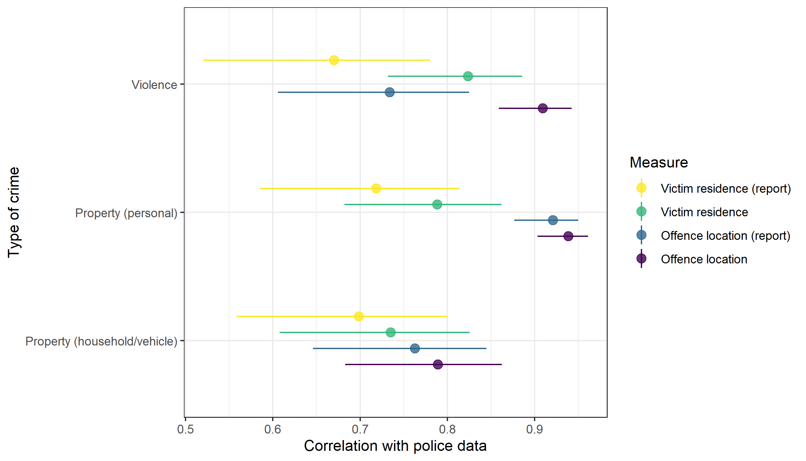
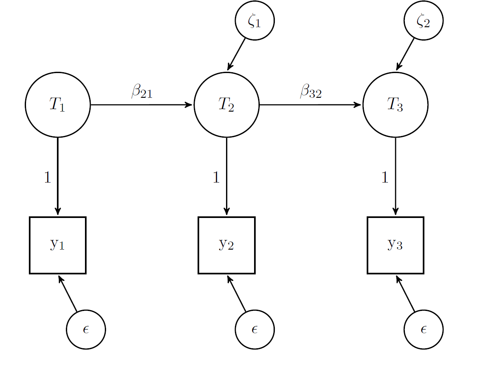
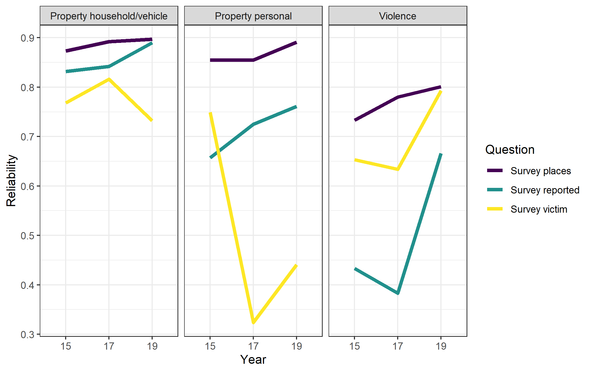
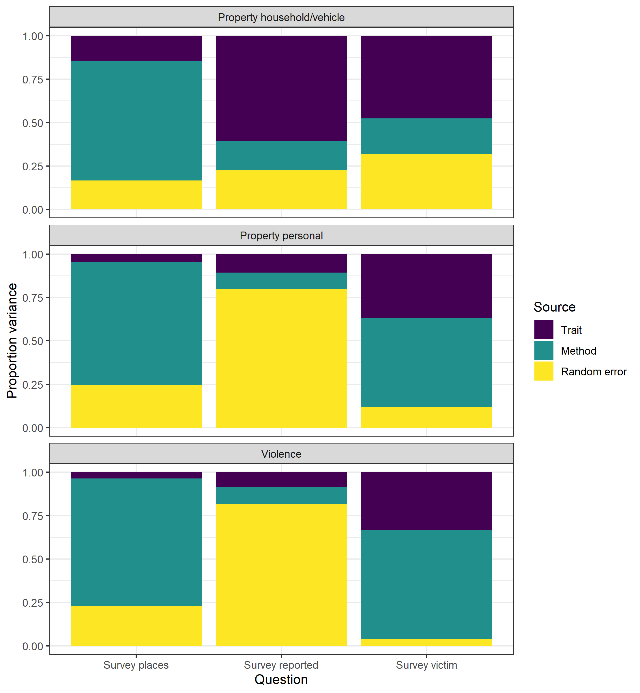

```{r setup, include=FALSE}
knitr::opts_chunk$set(echo = TRUE)

library(knitr)
```

## Descriptives

```{r}
include_graphics("./output/figs/avg_sd_change.png")


include_graphics("./output/figs/logrates_police_overall.png")


```

## Quasi-simplex


```{r}





```


## Multi-item quasi-simplex


```{r}

include_graphics("./output/figs/latex/long_eq_config.pdf")


```


## MTMM


```{r}


include_graphics("./output/figs/latex/mtmm.pdf")





```
